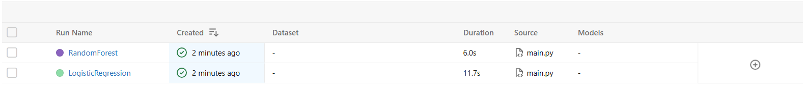
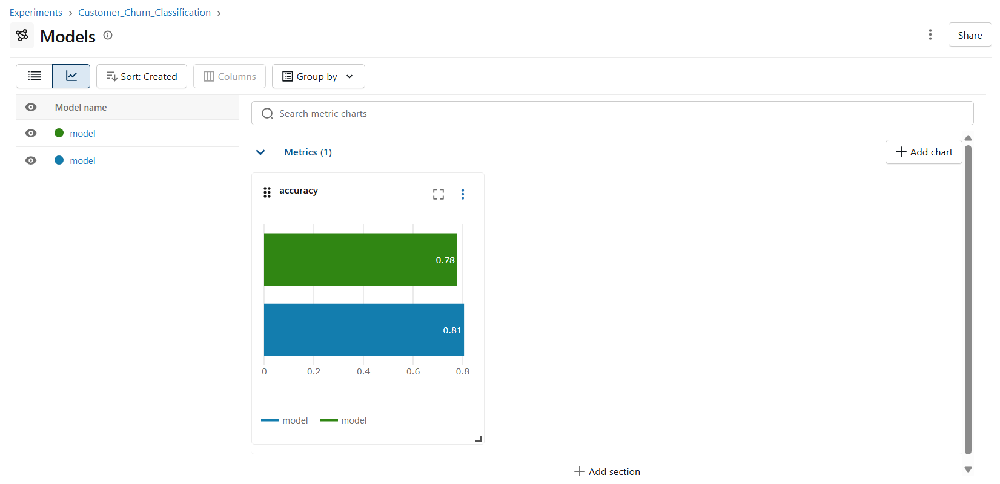
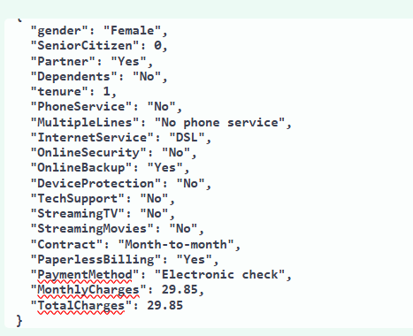
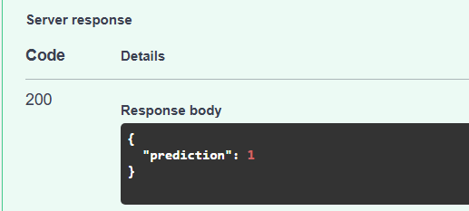
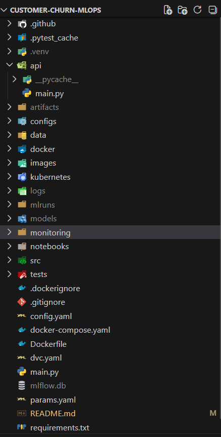

# End-to-End MLOps Customer Churn Prediction System

## Overview

This project demonstrates a complete production-style MLOps pipeline for customer churn prediction using a Kaggle dataset.

The project covers the complete machine learning lifecycle:

- Data ingestion
- Data validation
- Data transformation
- Model training
- Experiment tracking with MLflow
- REST API using FastAPI
- Docker containerization
- GitHub Actions CI/CD
- Kubernetes deployment
- Monitoring with Prometheus and Grafana

The objective is to build a reproducible and deployable machine learning system rather than just train a model.


## MLFlow





## Swagger





## Features

- End-to-end ML pipeline
- Modular codebase
- Automated preprocessing
- Multiple ML algorithms
- Model persistence
- MLflow experiment tracking
- REST prediction API
- Docker support
- Docker Compose
- GitHub Actions CI/CD
- Kubernetes manifests
- Prometheus monitoring
- Grafana dashboard

## Tech Stack

| Category | Tools |
|-----------|------|
| Language | Python |
| ML | Scikit-learn |
| Experiment Tracking | MLflow |
| API | FastAPI |
| Version Control | Git, GitHub |
| Containerization | Docker |
| Orchestration | Kubernetes |
| Monitoring | Prometheus, Grafana |
| CI/CD | GitHub Actions |


## Project Structure



## Pipeline Workflow

1. Data Ingestion
2. Data Validation
3. Data Transformation
4. Model Training
5. MLflow Experiment Tracking
6. Prediction API
7. Docker Containerization
8. GitHub Actions CI/CD
9. Kubernetes Deployment
10. Prometheus Monitoring
11. Grafana Dashboard

## Installation

Clone the repository

```bash
git clone <repository-url>
```

Create a virtual environment

```bash
python -m venv .venv
```

Activate

```bash
source .venv/bin/activate
```

Windows

```powershell
.venv\Scripts\activate
```

Install dependencies

```bash
pip install -r requirements.txt
```

## Train the Model

```bash
python main.py
```

Artifacts generated:

- preprocessor.pkl
- model.pkl

## MLflow

Start MLflow

```bash
mlflow ui
```

Open

http://localhost:5000


## FastAPI

Start API

```bash
uvicorn api.main:app --reload
```

Swagger UI

http://localhost:8000/docs

## Docker

Build

```bash
docker build -t churn-api .
```

Run

```bash
docker run -p 8000:8000 churn-api
```

## Docker Compose

```bash
docker compose up --build
```

## Kubernetes

Apply deployment

```bash
kubectl apply -f kubernetes/
```

View pods

```bash
kubectl get pods
```

View services

```bash
kubectl get svc
```

## Monitoring

Prometheus

http://localhost:9090

Grafana

http://localhost:3000


## CI/CD

GitHub Actions automatically

- Installs dependencies
- Builds Docker image
- Pushes image to GitHub Container Registry (GHCR)


## Results

- Best Model: Logistic Regression
- Accuracy: 81%


## Future Improvements

- Hyperparameter tuning
- Model drift detection
- Cloud deployment
- Helm charts
- Unit and integration tests

